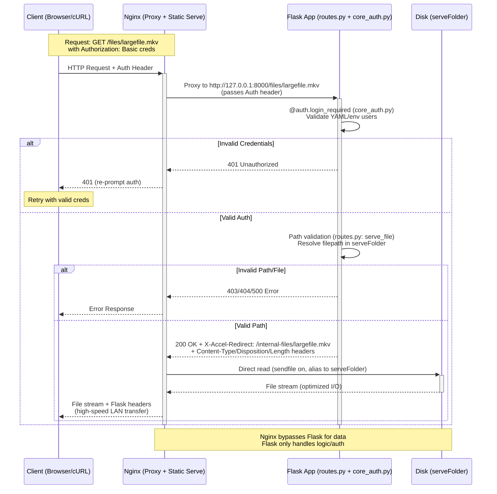
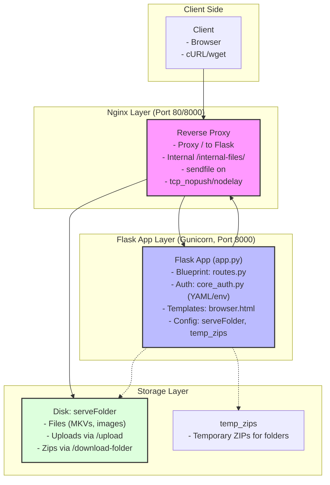

# Nginx + Flask Architecture for File Server

This diagram illustrates the request flow for a file download in the Flask File Server project, integrating Nginx as a reverse proxy with X-Accel-Redirect for efficient large-file serving on high-speed LANs. Authentication is handled by Flask's Basic Auth (from `core_auth.py` using YAML/env users), while Nginx offloads the actual file transfer from `serveFolder`.

Key Components:
- **Client**: Browser or curl with Basic Auth credentials.
- **Nginx**: Front-end proxy; handles static serving via internal location `/internal-files/`.
- **Flask App**: Runs on Gunicorn (e.g., port 8000); uses `routes.py` for endpoints like `/files/<filename>`, `core_auth.py` for auth validation.
- **serveFolder**: Disk storage for files (e.g., large MKVs); aliased in Nginx.

## Sequence Diagram: Authenticated File Download Flow

## High-Level Architecture Diagram

## Explanation
- **Entry Point**: All traffic hits Nginx first (for load balancing, SSL termination if added).
- **Dynamic Routes** (e.g., `/` listing, `/upload`): Proxied to Flask; auth enforced there.
- **File Download Routes** (e.g., `/files/<path>`): Proxied to Flask for auth/path checks; Flask redirects to Nginx internal path.
- **Static Serving**: Nginx directly reads from `serveFolder` (no Python overhead for large files).
- **Security**: Internal paths are protected (`internal;` directive); auth via Flask ensures only valid users trigger serving.
- **Performance**: On LAN, expect >100MB/s for large files (vs. <10MB/s pure Flask) due to Nginx's kernel sendfile.
- **Deployment**: Use Gunicorn for Flask concurrency; Nginx config as provided earlier.

This setup preserves your project's modularity (`routes.py`, `core_auth.py`) while optimizing for speed. For implementation, switch to code mode to apply changes.
