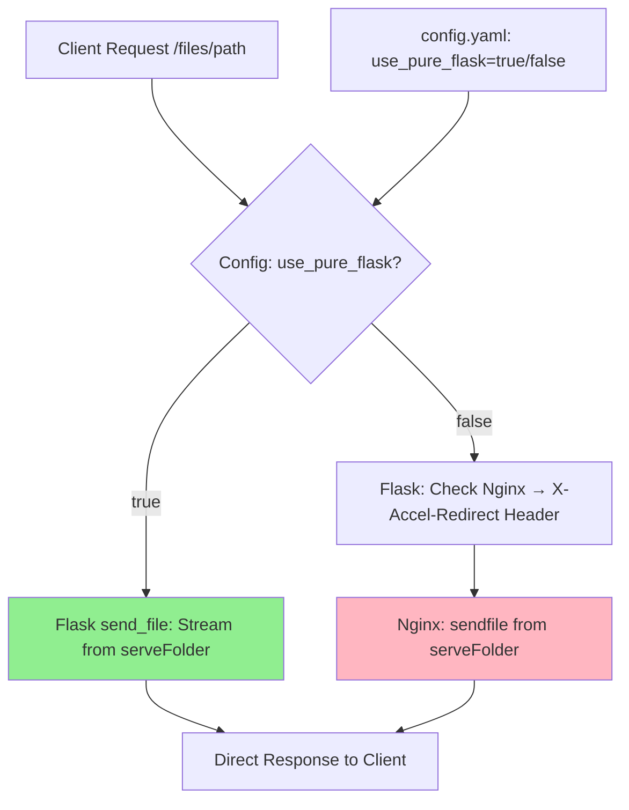

# Pure Flask File Serving Plan

## Evaluation of Current Setup
- **Nginx Integration**: The system uses Nginx as a reverse proxy on port 8000, forwarding dynamic requests (e.g., `/`, `/files/<path>`) to Flask/Gunicorn on port 8002. For file downloads (`/files/<path>`), Flask issues an `X-Accel-Redirect` header, which instructs Nginx to serve the file directly from `serveFolder` using efficient `sendfile` (kernel-level zero-copy transfer). This bypasses Flask for large files, reducing load.
- **Fallback Handling**: In [`routes.py`](routes.py:125-136), `serve_file` checks Nginx availability via a probe to `/internal-files/nonexistent.txt`. If unavailable, it returns a 500 error, preventing direct Flask serving.
- **Why Nginx?**: Optimizes for large files (e.g., up to 5GB via `MAX_CONTENT_LENGTH`), low memory usage, and high concurrency. Auth and logic stay in Flask.
- **Dependencies**: Requires Nginx config generation via [`nginx/create-conf.py`](nginx/create-conf.py), Gunicorn for Flask, and proper permissions on `serveFolder`.

## Feasibility of Pure Flask
- **Possible?**: Yes, fully feasible. Flask's [`send_file`](https://flask.palletsprojects.com/en/3.0.x/api/#flask.send_file) can serve files directly, streaming content to the client without loading the entire file into memory (uses Werkzeug's file streaming). No Nginx needed—Flask/Gunicorn can run standalone on port 8000.
- **Pros**:
  - Simpler deployment: Single process (e.g., `gunicorn app:app`), no proxy config or external service.
  - Quick setup for development/testing: Ideal for your "quick server" use case.
  - Maintains auth/upload/listing logic in Flask unchanged.
  - Supports attachments, MIME types, and range requests (partial downloads).
- **Cons/Limitations**:
  - **Performance**: Less efficient than Nginx's `sendfile` for very large files (>1GB) or high traffic. Flask streams via Python, using more CPU/memory (e.g., ~10-20% higher load). For quick/low-traffic servers, this is negligible.
  - **Concurrency**: Gunicorn workers (e.g., 4) handle requests, but each streaming download ties up a worker longer than Nginx.
  - **No Zero-Copy**: Lacks kernel optimizations; test with your files (e.g., `serveFolder/cpu-z_2.17-en.exe` ~10MB) to confirm.
  - **Edge Cases**: Very large uploads/downloads may hit timeouts (current 120s in Gunicorn); adjust via config.
- **When to Use**: Perfect for quick, low-volume servers. If scaling to production/high-load, stick with Nginx or consider alternatives like uvicorn (ASGI) for better async I/O.

## Suggested Implementation Plan
To enable pure Flask serving without breaking Nginx mode, use a deterministic config-based selection (no fallbacks or probes). The user explicitly chooses the mode via config.yaml (future UI support possible). Changes are minimal: if-else branches in key locations to preserve existing code flow.

### Checklist
- [ ] **Add Config Toggle**:
  - In `config.yaml`, add `use_pure_flask: false` (default false for backward compatibility with current Nginx setup).
  - Load in `app.py` as `flask_app.config['USE_PURE_FLASK'] = config.get('use_pure_flask', False)`.

- [ ] **Modify `serve_file` Route** (in `routes.py`):
  - Retain the existing Nginx probe (`check_nginx_availability`) but only use it if `not USE_PURE_FLASK`.
  - If `USE_PURE_FLASK`:
    - Directly use `return send_file(filepath, as_attachment=True, download_name=Path(filename).name, mimetype=content_type or 'application/octet-stream')`.
    - Preserve headers: `Content-Length`, `Content-Disposition`.
    - Log: "Serving via pure Flask".
  - Else (Nginx mode):
    - Run the probe; if fails, raise explicit error (e.g., 500: "Nginx required but unavailable").
    - Issue `X-Accel-Redirect` as before.
    - Log: "Serving via Nginx X-Accel-Redirect".
  - Minimal delta: Wrap existing logic in `if not current_app.config['USE_PURE_FLASK']:` else block for pure Flask.

- [ ] **Handle Folder Downloads**:
  - Already uses `send_file` for ZIPs—no change needed, as it's Flask-native and works in both modes.

- [ ] **Deployment Adjustments**:
  - For pure Flask (`use_pure_flask: true`): Run Gunicorn on port 8000 (update `start_gunicorn.sh` or command: `gunicorn -w 4 -b 0.0.0.0:8000 app:app`). No Nginx startup.
  - For Nginx mode (`use_pure_flask: false`): Keep current setup—Gunicorn on 8002, Nginx on 8000.
  - Add startup script checks: If pure Flask, skip Nginx commands; else, generate/start Nginx.
  - Minimal delta: Conditional logic in `start_gunicorn.sh` based on config.

- [ ] **Optimizations for Pure Flask**:
  - Increase Gunicorn timeout/workers for large files (e.g., via command-line flags or config).
  - Enable `sendfile` in Gunicorn if OS supports (via `--preload` or gevent worker).
  - Monitor memory: Test with large files from `serveFolder`.

### Future Tests (Implement When Requested)
- Unit tests: Update `tests/test_serve_file.py` to mock config toggle and verify both modes (Nginx X-Accel vs. direct send_file).
- Integration tests: Run with/without Nginx, download files/folders, check logs/response headers/sizes.

## Architecture Comparison

This revised plan ensures deterministic mode selection via config, minimal code changes (if-else wrappers), and no automatic fallbacks. Current Nginx functionality remains intact when `use_pure_flask: false`.